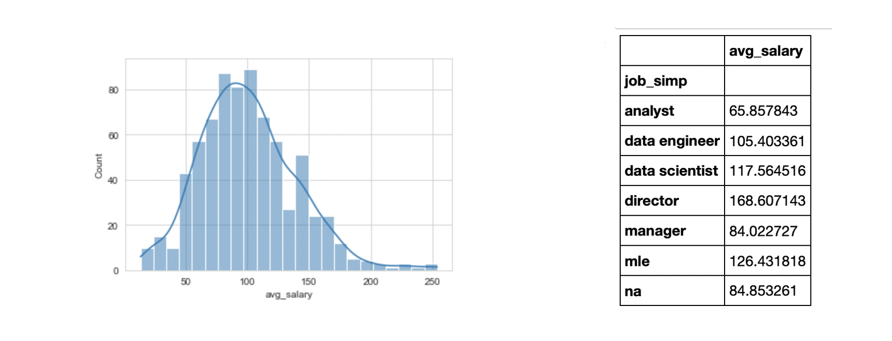

# <h1 align="center"><samp> Data Science Salary Prediction Project </samp></h1>

### Description:
In this project I predicted the salaries of Data Science jobs with a MAE of around $13K. I used Selenium to scrape over 1000 jobs from [Glassdoor](glassdoor.com) and then cleaned the data using Pandas in order to perform EDA. Then, I analyzed the data using Matplotlib & Seaborn, and trained models using Scikitlearn. Lastly, I deployed the model on the web using Flask, Docker, and AWS.

### Data:
Just for reference, the cleaned version on the scraped dataset in [here](DS_salary_data.csv). In the data scraping process, with each job position, I got the following details:
* Job title
* Salary Estimate
* Job Description
* Rating
* Company
* Location
* Company Headquarters
* Company Size
* Company Founded Date
* Type of Ownership
* Industry
* Sector
* Revenue
* Competitors in the market

### Tools:
* Python
* Numpy
* Pandas
* Matplotlib
* Seaborn
* SciKitLearn
* Flask
* Docker
* AWS

### References:
* This project is inspired from a Youtuber named [Ken Jee](https://www.youtube.com/channel/UCiT9RITQ9PW6BhXK0y2jaeg)
* Article for [scraping jobs from Glassdoor.com](https://towardsdatascience.com/selenium-tutorial-scraping-glassdoor-com-in-10-minutes-3d0915c6d905)
* Article for [deploying ML models to cloud](https://towardsdatascience.com/simple-way-to-deploy-machine-learning-models-to-cloud-fd58b771fdcf)
